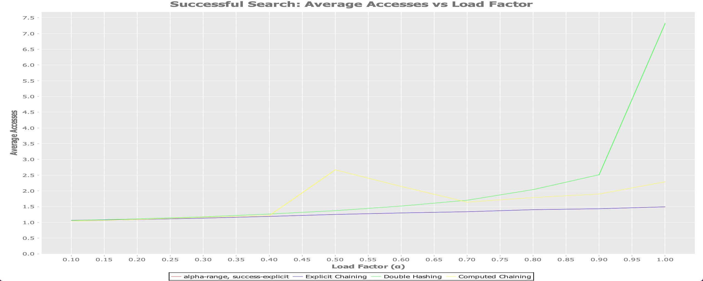

# hash-experiment

Foi implementado corretamente somente os algoritmos da primeira questão.
Os algoritmos da segunda questão foram implementados, mas não estão funcionando corretamente.

Um ponto de atenção na questão 1 foi que não consegui no até o final do prazo plotar corretamente os dados de teste de massa com o computed hash e o double hashing.
Por algum motivo ao testar em massa eles não retornam os valores corretos, porém testando caso a caso como no arquivo core.clj dá para ver seu correto funcionamento.

Abaixo colarei um gráfico com resultado do teste, note que somente o explicit hashing está aparecendo corretamente no gráfico.

No arquivo core.clj existe teste dos três algoritmos, todos retirados ou do slide ou dos livros textos citados como no caso do compputed chaining.

